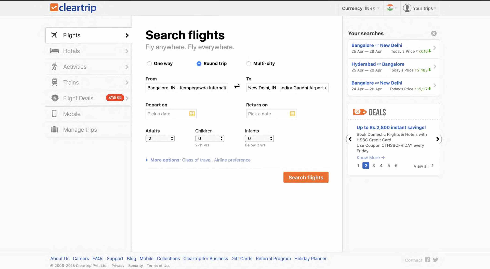

I recently appeared for the position of a UI Developer and it was a good experience. I will describe the interview process and update it after there are more rounds(or if there aren't).

The first round was a telephonic round. The interview began with a few standard questions about the years of experience I had and a few other basic introductory questions. The amount of experience is often used to set expectations. Usually people tend to add a month or two more than they have actually worked but it usually works fine if you are truthful about the experience. If you have less experience, the interviewer is then able to decide the kind of questions they can ask you. So, less experience and more knowledge is going to work in your favour.
Most of the questions were knowledge based, since they cannot ask you algorithms or data structures over the phone.

A few of the questions I was asked are :

---

**Q: Have you worked upon HTML template engines? Briefly describe your experience.**

The answer to this question can be "No." and the interviewer may not decide to pursue it further. If you haven't worked on any such frameworks, it's best to be truthful about it.

---

**Q: You have mentioned Knockout.js. Can you describe it and how is it different from other frameworks like jQuery.**

The question was again, experience oriented.

---

**Q: What design patterns have you used while programming in Javascript?**

I had used the Module pattern, Revealing module pattern and the Constructor pattern(which we use almost everyday). He then asked me the difference between Module and Revealing Module pattern.

---

**Q: How will you define a variable in the global scope inside a function in Javascript?**

There are more than one ways of doing this. The more ways you tell, the more brownie points you earn. I told only one way which was fine with the interviewer given my experience.
Do something like window.myVar = "Hello World";
Just write myVar = "Hello World" and it will define that variable in the global scope.
Difference between Global & Local scope of a function in Javascript.

---

**Q: What is prototype in Javascript?**

It is always good to explain such questions using an example since a definition is not easily remembered at the time of interviews.
Suppose you have a JSON object called `myObj`. Write a code that will print all the key-value pairs in that object.
Again, there is more than one way to do this. I told that there are two ways:
use `Object.getOwnPropertyNames()` and traverse the array while printing the value from that object.
or something like

```javascript
for (var i in myObj) {
  console.log(i + " " + myObj[i]);
}
```

---

**Q: Give me examples of some the new HTML5 features that you would have used in your projects till date.**

This was a subjective answer and it's best to talk about what you have actually used rather than just count out the new features.

---

**Q: Have you used Web Workers in Javascript?**

I hadn't but I was familiar with the concept. He inquired about the situation they should be used in and whether I could write the syntax. I said I couldn't write exact code but I knew an overview of how they worked. He was satisfied and moved on to the next question.

---

**Q: What is Offline Caching? How do I force the browser to get new files using a Javascript code?**

I didn't know the answer but he asked me to describe an approach if this was ever required. I talked about AMD and assumed that it could be done using require.js but I hadn't worked on that framework.

---

**Q: Suppose a user searches for hotels and you have 500 different Hotel Objects in a JSON. How would you represent this to the end user?**

This was a subjective answer and I described that we could use pagination/HTML templates to resolve this. He asked whether it was necessary to hit the server again if I were to display only 20 names on the first page. I said that I could just use template engines to display all of them without needing to make another AJAX call.

---

**Q: What is the difference between `instanceof` and `typeof`?**

`typeof` is a unary operator(takes only one parameter) which returns a string indicating the type of the unevaluated operand while `instanceof` is a binary operator which accepts two parameters, one object and the other a constructor.

Let us demonstrate the usage of `typeof`:

```javascript
const a = "This is a string primitive";
const b = new String("This is a String Object");

typeof a; --> returns 'string'
typeof b; --> returns 'object'
```

---

In contrast to `typeof`, this is how `instanceof` is used:

```javascript
const a = "This is a string primitive";
const b = new String("Thisnis a String Object");

a instanceof String; --> returns false
b instanceof String; --> returns true
```
